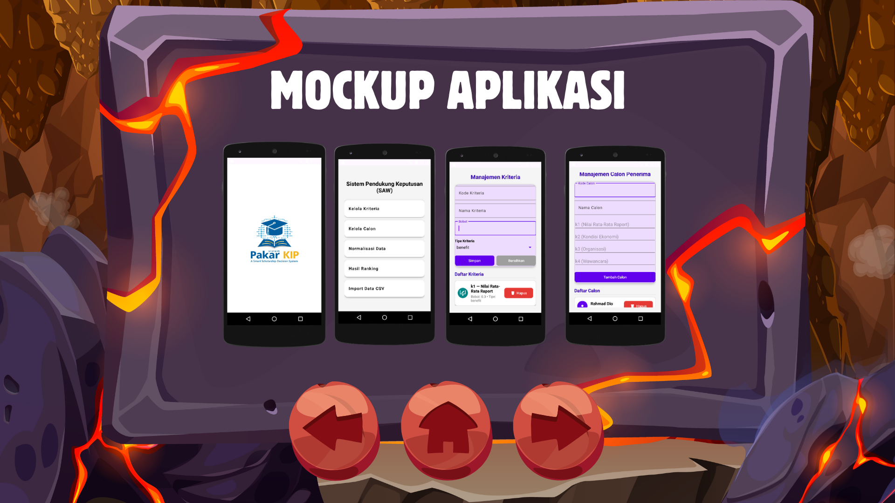

Berikut versi **README.md yang jauh lebih rapi, profesional, dan modern**, lengkap dengan format markdown GitHub + emoji + heading + badge + struktur folder yang bagus.

---

# 🎓 **Sistem Pakar Seleksi Penerima KIP Menggunakan Metode SAW**

Aplikasi Android untuk membantu proses seleksi penerima **Kartu Indonesia Pintar (KIP)** secara objektif menggunakan metode **SAW (Simple Additive Weighting)**.
Tujuan proyek ini adalah mempermudah proses pengambilan keputusan berdasarkan nilai setiap kriteria yang telah dinormalisasi.

---

## ✨ **Fitur Utama**

* 🎯 **Manajemen Kriteria**
  (Kode, Nama, Bobot, Jenis Benefit/Cost)
* 👥 **Manajemen Calon Penerima**
* 📥 **Import Data melalui CSV**
* 🧮 **Perhitungan otomatis metode SAW**
* 🏆 **Menampilkan hasil ranking penerima terbaik**
* 🎨 **UI modern berbasis Material Design**
* 💾 **Database lokal menggunakan Room**

---

## 🧮 **Metode SAW (Simple Additive Weighting)**

Metode SAW merupakan teknik pengambilan keputusan multikriteria melalui langkah berikut:

1. **Normalisasi matriks keputusan**
2. **Mengalikan nilai normal dengan bobot kriteria**
3. **Menjumlahkan nilai akhir tiap alternatif**
4. **Mengurutkan nilai untuk mendapatkan ranking terbaik**

Metode ini sangat cocok digunakan untuk proses seleksi penerima bantuan seperti KIP.

---

## 🏗 **Teknologi yang Digunakan**

* 🟦 Kotlin
* 🛠 Android Studio
* 🗄 Room Database
* 🎨 Material Design Components
* 📊 CSV File Processing
* 🔧 MVVM Architecture (opsional)

---

## 📂 **Struktur Proyek**

```
/app
  /src
    /main
      /java/com/dio/sistempakarkip
      /res/layout
      /res/drawable
      /res/values
  build.gradle
gradle.properties
settings.gradle
```

---

## 📦 **Download Project**

📁 **Download ZIP Lengkap Proyek**
👉 [https://www.mediafire.com/file/7dj5twzk3spe5ai/sistempakarkip.zip/file](https://www.mediafire.com/file/7dj5twzk3spe5ai/sistempakarkip.zip/file)

📱 **Download Aplikasi (APK)**
👉 [https://www.mediafire.com/file/hft91vrhpcqfybu/app-debug.apk/file](https://www.mediafire.com/file/hft91vrhpcqfybu/app-debug.apk/file)

---

## 📸 **Screenshot (Opsional)**

> Tambahkan screenshot aplikasi di sini setelah kamu upload ke GitHub.
> Gunakan format berikut:

```



```
